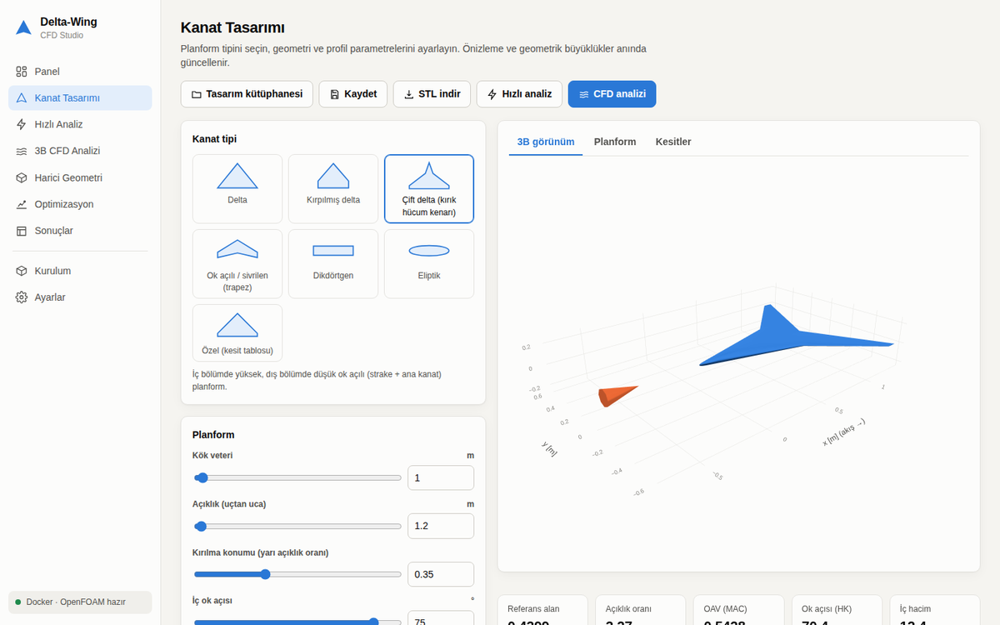
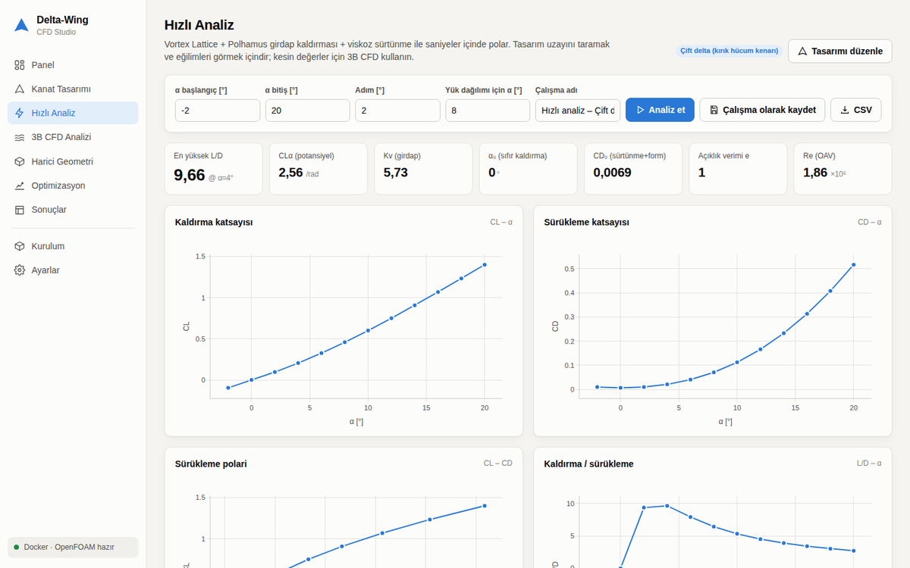
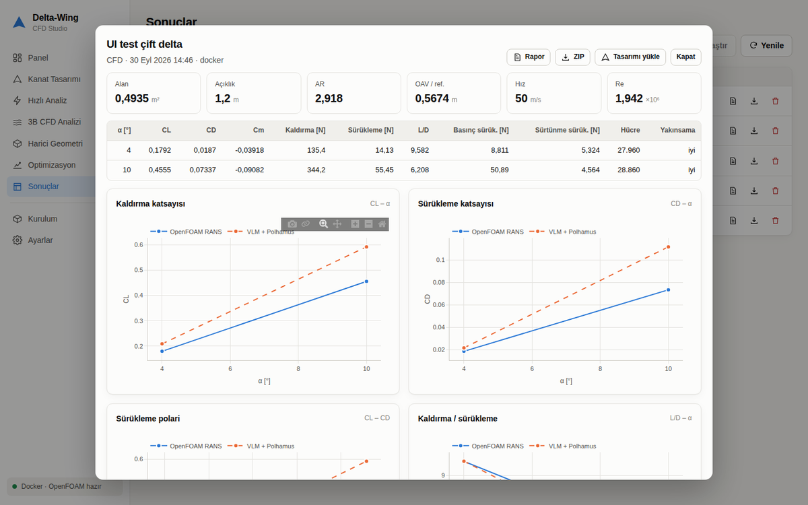
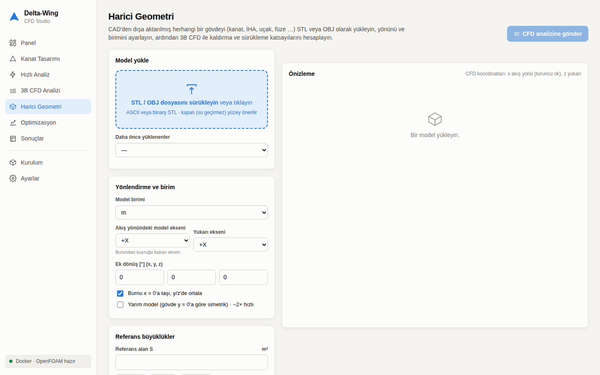
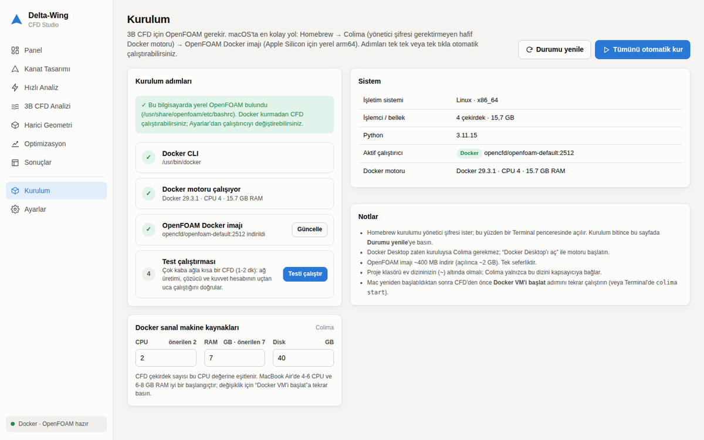
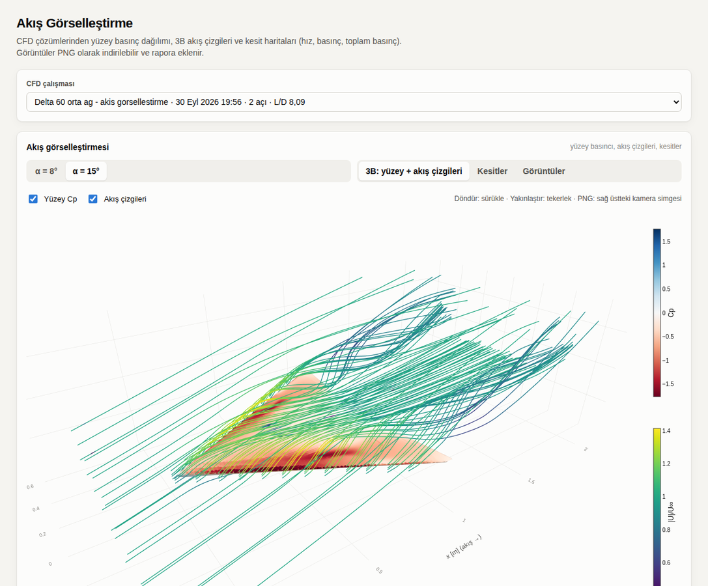
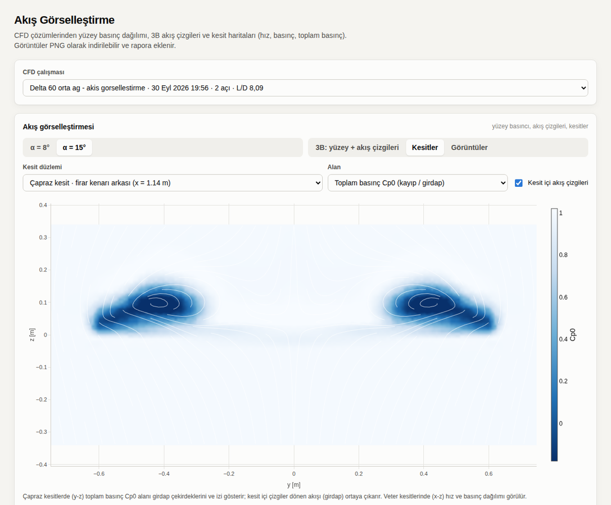

# Delta-Wing CFD Studio

Kanat tasarımı, hızlı aerodinamik analiz, **OpenFOAM ile 3B RANS CFD** ve otomatik
optimizasyon için masaüstü web uygulaması. Farklı kanat tiplerini (delta, çift delta,
trapez, eliptik, özel …) veya **kendi STL/OBJ geometrinizi** analiz edip kaldırma,
sürükleme ve moment katsayılarını ve kuvvetlerini hesaplar. macOS (Apple Silicon)
için Docker + OpenFOAM kurulumu arayüzden tek tıkla yapılır.



## İçindekiler
- [macOS'ta hızlı başlangıç](#macosta-hızlı-başlangıç)
- [Özellikler](#özellikler)
- [Arayüz sayfaları](#arayüz-sayfaları)
- [Kurulum otomasyonu nasıl çalışır](#kurulum-otomasyonu-nasıl-çalışır)
- [Akış görselleştirme](#akış-görselleştirme)
- [Harici geometri](#harici-geometri)
- [CFD kurulumu ve doğruluk](#cfd-kurulumu-ve-doğruluk)
- [Komut satırı (CLI)](#komut-satırı-cli)
- [Proje yapısı](#proje-yapısı)

## macOS'ta hızlı başlangıç

```bash
git clone https://github.com/emirhnyl/Delta-Wing.git ~/Delta-Wing
cd ~/Delta-Wing
./start_mac.command
```

`start_mac.command` dosyasına Finder'da çift tıklamanız da yeterli. İlk açılışta Python
sanal ortamını (`.venv`) kurar (1-2 dk), ardından tarayıcıda
**http://127.0.0.1:8765** adresini açar. Uygulamayı kapatmak için Terminal penceresinde
`Ctrl+C`'ye basın.

Ardından arayüzde **Kurulum → Tümünü otomatik kur**'a basın. Homebrew yoksa önce bir
Terminal penceresi açılır ve Mac şifreniz istenir; sonrasındaki adımlar (Colima, Docker CLI,
Docker sanal makinesi, OpenFOAM imajı, test çalıştırması) arayüzden, canlı günlükle yürür.

> Gereksinimler: macOS 12+ (önerilen 13+), Python 3.9+ (Xcode Command Line Tools ile
> gelir: `xcode-select --install`), ~4 GB boş disk. Proje klasörü ev dizininizin (`~`)
> altında olmalıdır (Colima yalnızca bu dizini kapsayıcıya bağlar).

Hızlı analiz ve optimizasyon **kurulum gerektirmez**; OpenFOAM yalnızca 3B CFD için gerekir.

Linux'ta: `./start.sh` (Docker veya yerel OpenFOAM kurulu olmalı).

## Özellikler

**Geometri**
- 7 planform tipi: delta, kırpılmış delta, çift delta (kırık hücum kenarı), ok açılı/sivrilen
  (trapez), dikdörtgen, eliptik, özel kesit tablosu. Burulma (washout) ve dihedral.
- Kök ve uç için ayrı profil: NACA 4 haneli (sürekli kamber/kalınlık), Kulfan CST veya
  Selig formatında `.dat` dosyası yükleme. Kökten uca karışım.
- Anında 3B önizleme, planform ve kesit görünümleri; alan, açıklık oranı, OAV, ok açısı,
  iç hacim, Reynolds, Mach. Su geçirmez STL dışa aktarma.
- Tasarım kütüphanesi (kaydet / yükle).

**Akış koşulları**: hız + ISA standart atmosfer (irtifa ve sıcaklık sapmasından yoğunluk,
viskozite, ses hızı) veya elle girilen değerler.

**Hızlı analiz** (saniyeler): Vortex Lattice + Polhamus girdap kaldırması + viskoz sürtünme;
CL/CD/L-D polarları, açıklık boyunca yük dağılımı (eliptik dağılımla karşılaştırma), yerel
kesit cl dağılımı (uç stall eğilimi), CD₀, açıklık verimi.

**3B CFD** (OpenFOAM simpleFoam, k-ω SST)
- Otomatik ağ (blockMesh + snappyHexMesh), kaba/orta/ince ön ayarları ve gelişmiş ayarlar
  (rafinasyon seviyeleri, sınır tabakası katmanları, iterasyon, çekirdek sayısı).
- Her hücum açısı ayrı vaka; **canlı** artık (residual) grafiği, CL/CD yakınsaması, aşama
  ve kalan süre tahmini, iptal.
- Sonuçlar: CL, CD, Cm, kaldırma [N], sürükleme [N], L/D, basınç/sürtünme sürükleme ayrımı,
  hücre sayısı, yakınsama değerlendirmesi; hızlı model ile karşılaştırma.
- Yarım model (simetri düzlemi) veya tam model.

**Akış görselleştirme**: her CFD açısı için otomatik olarak yüzey basınç katsayısı (Cp)
renklendirmesi, 3B akış çizgileri (hıza göre renkli), veter ve çapraz akış kesitlerinde hız,
basınç ve toplam basınç haritaları ile kesit içi akış çizgileri; etkileşimli 3B görünüm ve PNG
görüntüler (rapora ve ZIP'e eklenir).

**Harici geometri**: STL/OBJ yükleme, birim (mm/cm/m/in/ft), eksen yönlendirme, ek dönüş,
ortalama; planform/ön/ıslak alan, hacim ve sızdırmazlık analizi; referans alan/uzunluk/moment
noktası seçimi; aynı CFD akışıyla analiz.

**Optimizasyon**: seçilen planform/profil değişkenleri, amaç (L/D, sürükleme, kaldırma, CD, CL),
sabit kaldırma (seyir) veya sabit açı, kısıtlar (min. kaldırma, iç hacim, alan, açıklık, t/c …),
differential evolution / Nelder-Mead / Powell; hızlı çözücü veya doğrudan CFD. Canlı yakınsama;
en iyi tasarımı tek tıkla uygula ve CFD ile doğrula.

**Sonuçlar ve raporlama**: tüm çalışmalar kalıcı olarak saklanır; çoklu karşılaştırma,
yazdırılabilir HTML rapor (geometri, koşullar, sonuç tabloları, grafikler, yöntem),
ZIP (sonuçlar + CSV + CFD günlükleri), STL.

## Arayüz sayfaları

| Sayfa | İşlev |
|---|---|
| Panel | Aktif tasarım, CFD ortam durumu, çalışan işler, son çalışmalar |
| Kanat Tasarımı | Tip seçimi, planform, profil editörü, akış koşulları, 3B önizleme |
| Hızlı Analiz | α taraması, polarlar, yük dağılımı, tablo, CSV |
| 3B CFD Analizi | Kaynak (tasarım/harici), açılar, ağ ön ayarı, canlı izleme, sonuçlar |
| Harici Geometri | STL/OBJ yükleme, yönlendirme, referans büyüklükler |
| Akış Görselleştirme | Yüzey Cp + 3B akış çizgileri, kesit haritaları, görüntü galerisi |
| Optimizasyon | Değişkenler, amaç, kısıtlar, canlı yakınsama, en iyi tasarım |
| Sonuçlar | Çalışma geçmişi, karşılaştırma, rapor, ZIP |
| Kurulum | Homebrew → Colima/Docker → OpenFOAM imajı → test; kaynak ayarları |
| Ayarlar | Çalıştırıcı (otomatik/Docker/yerel), Docker imajı, çekirdek sayısı, tema |

| | |
|---|---|
|  |  |
|  |  |

## Kurulum otomasyonu nasıl çalışır

macOS'ta Docker Desktop yerine, yönetici şifresi gerektirmeyen ve lisans kısıtı olmayan
**Colima** kullanılır:

1. **Homebrew**: resmi kurulum betiği Terminal'de açılır (şifre gerektirir).
2. `brew install colima docker`
3. `colima start --cpu N --memory M --disk D --mount ~:w --vm-type vz --mount-type virtiofs`
   (macOS 13+; CPU/RAM arayüzden ayarlanır, CFD çekirdek sayısı buna eşitlenir)
4. `docker pull opencfd/openfoam-default:2512` (Apple Silicon için yerel **arm64** imaj)
5. Çok kaba ağla kısa bir test CFD (ağ + çözücü + kuvvet hesabı uçtan uca)

Docker Desktop zaten kuruluysa algılanır ve kullanılır. Bilgisayarda yerel OpenFOAM varsa
(`/usr/lib/openfoam/…`, `/opt/openfoam…` vb.) Docker'a gerek kalmaz. Mac yeniden başladıktan
sonra CFD öncesinde Kurulum sayfasında **Docker VM'i başlat**'a basın (veya `colima start`).

## Akış görselleştirme

Her CFD açısı çözüldükten sonra `deltawing/postprocess.py` OpenFOAM çözümünü (ağ + p, U)
doğrudan okur. ParaView veya OpenFOAM'ın kendi son-işleme araçları gerekmez. Ürettikleri:

| Görsel | Ne gösterir |
|---|---|
| Yüzey Cp (üst/alt, 3B) | Basınç dağılımı; delta kanatta hücum kenarı girdaplarının üst yüzeydeki emme izi |
| 3B akış çizgileri | Gövde etrafındaki akış; hücum kenarından ayrılıp girdaba sarılan çizgiler |
| Veter kesitleri (x-z, %25/50/75 yarı açıklık) | Cp ve \|U\|/U∞ haritaları, kesit içi akış çizgileri |
| Çapraz kesitler (y-z: gövde ortası, firar kenarı, iz) | Toplam basınç Cp0 (girdap çekirdekleri ve iz) ve dönen akış |

Tanımlar: `Cp = p/(½U∞²)`, `Cp0 = (p + ½|U|²)/(½U∞²)` (serbest akışta 1, girdap ve izde < 1).
Arayüzde **Akış Görselleştirme** sayfasından ya da CFD sonuç ekranından açılır. Etkileşimli
grafikler sağ üstteki kamera simgesiyle PNG olarak kaydedilir. Görselleştirmeden önce çalışılmış
eski CFD çalışmaları için “Görselleştirmeyi oluştur” düğmesi vardır.

| | |
|---|---|
|  |  |

## Harici geometri

1. **Harici Geometri** sayfasında STL/OBJ dosyasını sürükleyin (birim otomatik tahmin edilir).
2. *Akış yönündeki model ekseni*ni (burundan kuyruğa) ve *yukarı* eksenini seçin; önizlemede
   turuncu ok akış yönünü gösterir.
3. Referans alanı seçin: kanatlar için **planform**, gövde/füze için genelde **ön alan**.
   Katsayılar bu alana göre normalize edilir: `L = CL·q·S`, `D = CD·q·S`.
4. Gövde y = 0'a göre simetrikse **Yarım model**'i işaretleyin (yaklaşık 2× hızlı).
5. **CFD analizine gönder** → açıları seçip başlatın.

Kapalı (su geçirmez) yüzeyler önerilir; açık kenarlar varsa uyarı gösterilir.

## CFD kurulumu ve doğruluk

- Alan: gövdenin 5 boy önünde, 10 boy arkasında, 5 boy yanlarda/dikeyde; dış sınırlarda
  `freestreamVelocity/freestreamPressure`. Hücum açısı hız vektörüyle verilir (ağ yeniden
  kullanılabilir).
- Duvar: `nutUSpaldingWallFunction` (y⁺'dan bağımsız). Sınır tabakası katmanları isteğe bağlı.
- Kuvvetler OpenFOAM `forceCoeffs` ile alınır. Fonksiyon nesneleri çalışmayan kurulumlarda
  (ör. Ubuntu `openfoam` 1912 paketi) basınç ve duvar kayma gerilmesi alanlardan Python'da
  integre edilir. İki yöntem aynı vakada %0.03 içinde örtüşür.
- **Ağ bağımsızlığı**: Kesin değerler için ağı kaba → orta → ince yapıp CL/CD değişimi
  %1-2'nin altına inene kadar tekrarlayın. Sürükleme (özellikle sürtünme) ağa daha duyarlıdır.
- **Hızlı çözücü**: tasarım uzayını taramak içindir. Polhamus modeli keskin hücum kenarı varsayar,
  yuvarlak burunlu profillerde sürüklemeyi yüksek tahmin edebilir; stall ve girdap patlaması
  (~20° üzeri) modellenmez. VLM, Bertin & Smith Örnek 7.2 ile birebir doğrulanmıştır.

Örnek (60° delta, 1.2 m açıklık, NACA 0008→0006, 50 m/s, ~158 bin hücre):

| α [°] | CL | CD | Kaldırma [N] | Sürükleme [N] | L/D |
|---:|---:|---:|---:|---:|---:|
| 4 | 0.172 | 0.0163 | 165.5 | 15.7 | 10.5 |
| 8 | 0.362 | 0.0449 | 349.4 | 43.3 | 8.07 |
| 12 | 0.532 | 0.0961 | 513.2 | 92.7 | 5.54 |

## Komut satırı (CLI)

Arayüz olmadan da kullanılabilir:

```bash
python run.py geometry -c config/delta_wing.yaml        # STL + görsel
python run.py quick    -c config/delta_wing.yaml        # hızlı polar
python run.py cfd      -c config/delta_wing.yaml --alpha 4 8 12
python run.py optimize -c config/optimize_vlm.yaml --verify
python run.py cfd --set wing.type=double_delta --set wing.inner_sweep_deg=72
```

Konfigürasyon alanları için `deltawing/config.py` (varsayılanlar) ve `deltawing/planforms.py`
(kanat tipi parametreleri) dosyalarına bakın. `openfoam.runner: docker` ile CLI de Docker'da çalışır.

Testler: `python -m pytest tests -q`

## Proje yapısı

```
Delta-Wing/
├── start_mac.command       # macOS başlatıcı (çift tıkla)
├── start.sh                # Linux başlatıcı
├── app/
│   ├── server.py           # FastAPI sunucu + REST API
│   └── static/             # arayüz (HTML/CSS/JS, Plotly)
├── deltawing/
│   ├── planforms.py        # kanat tipleri
│   ├── geometry.py         # genel kanat modeli, su geçirmez yüzey, STL
│   ├── airfoil.py          # NACA 4, CST, .dat
│   ├── atmosphere.py       # ISA
│   ├── vlm.py              # VLM + Polhamus + viskoz direnç, yük dağılımı
│   ├── external.py         # STL/OBJ içe aktarma, yönlendirme, alan/hacim analizi
│   ├── openfoam.py         # OpenFOAM vaka üretimi, çalıştırma, sonuç okuma
│   ├── runner.py           # yerel / Docker çalıştırıcı
│   ├── foamforces.py       # alanlardan kuvvet integrasyonu
│   ├── monitor.py          # canlı artık / katsayı izleme
│   ├── postprocess.py      # akış görselleştirme: yüzey Cp, kesitler, 3B akış çizgileri
│   ├── jobs.py             # arka plan iş kuyruğu
│   ├── setup_env.py        # ortam kontrolü, Homebrew/Colima/Docker otomasyonu
│   ├── studies.py          # çalışma kayıtları, CFD/optimizasyon işleri, HTML rapor
│   ├── optimize.py         # optimizasyon döngüsü
│   └── plots.py            # rapor grafikleri (matplotlib)
├── config/                 # örnek YAML konfigürasyonları (CLI)
├── tests/
├── runs/                   # çalışma sonuçları (git dışı)
└── data/                   # yüklenen geometriler, profiller, tasarımlar, ayarlar (git dışı)
```
